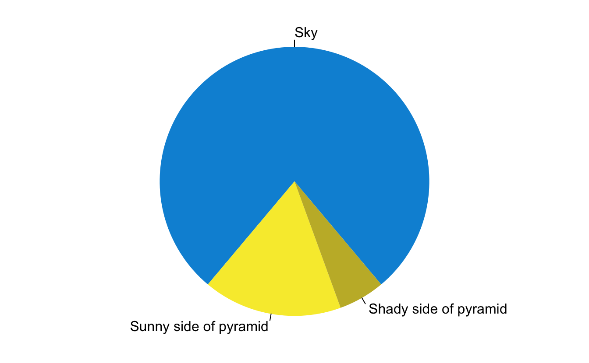

# 1. Objectives

In this tutorial we will:

1.  Briefly describe the concepts relating to the Australian Mental Health Systems Models Dataverse repository; and

2.  Outline the steps required to search for and download files contained in repository datasets using two alternative approaches;

    -   Using a web based interface (very simple, suitable for low volume requests where reproducibility is not required); and
    -   Using R commands (an approach that requires a little more up-front learning, but which can be used in automated and reproducible workflows)

# 2. Concepts

Information about how to install.

<pre class='chroma'><code class='language-r' data-lang='r'><a href='https://rdrr.io/r/base/summary.html'>summary</a>(cars)#&gt;      speed           dist       
#&gt;  Min.   : 4.0   Min.   :  2.00  
#&gt;  1st Qu.:12.0   1st Qu.: 26.00  
#&gt;  Median :15.0   Median : 36.00  
#&gt;  Mean   :15.4   Mean   : 42.98  
#&gt;  3rd Qu.:19.0   3rd Qu.: 56.00  
#&gt;  Max.   :25.0   Max.   :120.00
fit &lt;- <a href='https://rdrr.io/r/stats/lm.html'>lm</a>(dist ~ speed, data = cars)</code></pre>

<pre class='chroma'><code class='language-r' data-lang='r'>fit#&gt; 
#&gt; Call:
#&gt; lm(formula = dist ~ speed, data = cars)
#&gt; 
#&gt; Coefficients:
#&gt; (Intercept)        speed  
#&gt;     -17.579        3.932</code></pre>

# Worked example

Some simple code to demonstrate how to use it.

<pre class='chroma'><code class='language-r' data-lang='r'><a href='https://rdrr.io/r/graphics/par.html'>par</a>(mar = <a href='https://rdrr.io/r/base/c.html'>c</a>(0, 1, 0, 1))
<a href='https://rdrr.io/r/graphics/pie.html'>pie</a>(
  <a href='https://rdrr.io/r/base/c.html'>c</a>(280, 60, 20),
  <a href='https://rdrr.io/r/base/c.html'>c</a>('Sky', 'Sunny side of pyramid', 'Shady side of pyramid'),
  col = <a href='https://rdrr.io/r/base/c.html'>c</a>('#0292D8', '#F7EA39', '#C4B632'),
  init.angle = -50, border = NA
)</code></pre>

A fancy pie chart.

